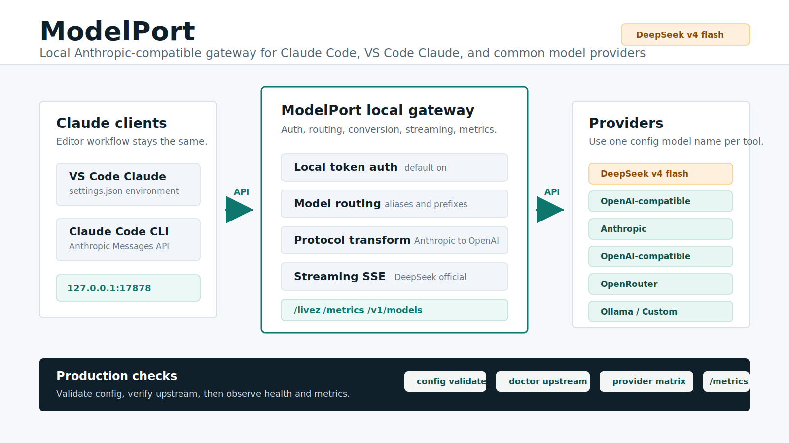

# ModelPort

[](https://github.com/tiammomo/ModelPort/actions/workflows/ci.yml)

[English](README.md) | **简体中文**

ModelPort 是面向 Claude Code / VS Code Claude 的本地模型网关。它在本机暴露 Anthropic-compatible `/v1/messages` 接口，然后把请求路由到 DeepSeek、Mimo、Anthropic、OpenAI-compatible provider、OpenRouter、Ollama 或自定义本地运行时。

它的目标很明确：不改变编辑器工作流，通过一个本地、可观测、带鉴权的端口切换不同模型。



## 项目介绍

ModelPort 是一个本地模型路由网关，不是聊天应用，也不是重型企业模型平台。它的核心职责是让 Claude Code 和 VS Code Claude 继续使用它们熟悉的 Anthropic Messages API，同时由 ModelPort 在这个协议边界上处理鉴权、路由、协议转换、provider 健康状态、请求日志、配额和账号治理。

项目面向个人、独立开发者和小团队：你只需要维护一个稳定的本地端口，把日常编码工作流接到不同上游模型。实际使用时，编辑器请求 `http://127.0.0.1:17878/v1/messages`，ModelPort 再把请求解析到 DeepSeek 官方 Anthropic-compatible API、OpenAI-compatible provider、Anthropic、OpenRouter、Mimo、Ollama 或自定义本地运行时。

当前标准样例刻意保持保守：使用 DeepSeek 官方 Anthropic-compatible API，模型使用 `deepseek-v4-flash`。这样主链路更接近 Claude Code 的原始协议形态，减少不必要的转换风险，也为后续 provider 适配提供一个清晰样板。

ModelPort 由三层能力组成：

- **协议网关层：**接收 Anthropic-compatible 客户端请求，校验请求结构，执行轻量限制，然后直通 Anthropic-compatible 上游或转换到 OpenAI-compatible 上游。
- **路由与策略层：**解析 `provider:model`、别名、默认 provider、模型前缀、provider 顺序、API Key 策略、团队策略、配额、IP allowlist 和 provider 账号池。
- **运维控制面：**通过 Dashboard 管理 API Key、用户、团队/项目、provider 生命周期、模型库存、日志、指标、健康状态、备份、诊断和配置热加载。

## GPT Image 2 定位

`gpt-image-2` 是 ModelPort 后续多模态方向的重要参考，但不应该混入当前 Claude Code 文本主链路。当前已经实现的主路径是面向编码工作流的 Anthropic-compatible 文本消息和 SSE 流式响应。图片生成和编辑有完全不同的运维约束：更大的请求和响应体、base64 或文件载荷、multipart 编辑、没有文本 token 流式语义、更敏感的成本控制，以及更严格的日志脱敏要求。

因此，ModelPort 对 GPT Image 2 的定位是独立扩展方向：

- README 图示可以用 `gpt-image-2` 生成方向稿，再提交为可编辑的 `docs/assets` SVG。
- 未来图片能力应使用独立 provider 协议，例如 `openai-images`。
- 未来图片接口应使用明确的图片路由，例如 `POST /v1/images/generations` 和 `POST /v1/images/edits`。
- 已有控制面能力可以复用：API Key、provider 路由、配额、请求大小限制、secret redaction、provider health 和 Dashboard 诊断。

详细扩展建议见 [docs/GPT_IMAGE_2_GUIDE.md](docs/GPT_IMAGE_2_GUIDE.md)。当前 README 不把 GPT Image 2 服务能力描述为已实现能力。

## 项目重难点

| 方向 | 难点 | 当前处理方式 |
| --- | --- | --- |
| 协议兼容性 | Claude Code 期望 Anthropic Messages 语义，但很多上游是 OpenAI-compatible chat API，请求字段、流式 chunk、tool-call 形态和错误体都不一致。 | 保持 Anthropic 作为客户端契约，使用聚焦的 provider adapter，支持 provider 级 `max_tokens` 行为；DeepSeek 官方 Anthropic-compatible 路径尽量直通，并用测试覆盖 streaming、tool 和错误映射。 |
| 流式正确性 | SSE 流可能重放部分文本、拆分 JSON frame、增量输出 tool-call arguments，或者在响应头发出后才失败。 | 统一解析 SSE frame，把上游流式错误映射为 Anthropic-style error event，对需要的 provider 做流式文本去重，并把 provider 特性收敛到 adapter 配置里。 |
| 路由策略 | 小型网关也需要稳定处理模型 ID、别名、`provider:model`、前缀、默认 provider、禁用 provider、发现模型和账号池。 | 使用运行时配置快照加控制面 override，在 Dashboard 暴露模型库存，并验证公开模型列表只包含可用且已配置的 provider。 |
| 鉴权与权限 | 个人使用希望一个本地 token 就能跑，小团队又需要每个 key 的限制，但不想引入 OIDC 或重型企业身份系统。 | 保留 legacy router token 作为本地简单模式，同时支持 Dashboard 签发 API Key、模型/provider 白名单、IP 限制、配额、费用限制和可选的 `MODELPORT_REQUIRE_CONTROL_API_KEYS=1`。 |
| 安全边界 | Provider URL、Dashboard 写操作、公开健康检查、日志和上游错误体都可能成为 SSRF 或 secret 泄漏入口。 | 校验 provider base URL，默认阻止 private/metadata 地址，错误信息做 secret redaction，Dashboard 写操作校验 CSRF/Origin，详细 readiness 需要鉴权，请求体在路由前做大小限制。 |
| 稳定性与账号治理 | 上游失败形态很多：限流、5xx、无效 key、余额不足、慢流、半截响应。 | 记录 provider 和 credential health，设置 cooldown，支持手动/故障切换/轮询账号池，余额不足渠道标记 `代充值`，并提供 `livez`、`readyz`、smoke、acceptance 和 doctor 脚本。 |
| 可观测性与低运维 | 个人和小团队需要足够诊断能力，但不适合一开始就引入 Redis、Kubernetes、服务网格或外部 tracing。 | 使用进程内 metrics、带鉴权的 Prometheus 输出、请求日志、trace/request id、provider health、Dashboard 诊断、PostgreSQL 或 JSON 存储，以及简单 shell 验证脚本。 |
| 未来图片能力 | GPT Image 2 类工作负载需要不同的 body 限制、成本控制、隐私规则、响应处理和 UI 交互。 | 不把图片能力塞进 `/v1/messages`，文档中规划独立 `openai-images` 扩展路径，并要求图片路由上线前先完成请求/响应上限和 base64 脱敏。 |

## Tool Use 兼容性

ModelPort 把 tool use 当成协议契约的一部分，而不是普通文本转发。DeepSeek Anthropic-compatible 路径会保留 Anthropic 原生的 `tools`、`tool_choice`、`tool_use` 和 `tool_result` 结构。OpenAI-compatible adapter 会把 Anthropic tool definition 转成 OpenAI function tools，映射 `tool_choice`，把 assistant 的 `tool_use` 转成 `tool_calls`，并把 user 的 `tool_result` 转成 `role=tool` 消息。

响应侧会把 OpenAI `tool_calls` 转回 Anthropic `tool_use` content block。流式 tool call 会按上游 tool-call index 维护状态，并输出 Anthropic 风格的 `content_block_start`、`input_json_delta` 和 `content_block_stop`。对于会重放累计 tool arguments 的 provider，ModelPort 会对 arguments 分片做去重，并在收尾时尽量恢复最完整的 JSON object。

网关现在会在路由前校验 tool name、`tool_choice`、assistant `tool_use`、user `tool_result` 和工具载荷大小。Provider 也会暴露轻量 `tool_use` capability matrix，覆盖是否支持 tool use、`tool_choice`、并行工具调用，以及流式 arguments 模式：`native`、`delta`、`cumulative` 或 `best_effort`。strict fidelity 模式仍会拒绝 OpenAI-compatible provider 无法安全保真的 Anthropic 特性。后续可以基于这个矩阵继续演进内部 Tool IR，但当前实现已经覆盖 Claude Code 常见工具调用主链路，同时避免过早引入过重抽象。

详细 Tool Use 契约、校验规则、provider 能力矩阵和流式行为见 [docs/TOOL_USE_COMPATIBILITY.md](docs/TOOL_USE_COMPATIBILITY.md)。

## 当前实际配置

当前工作区已经按下面配置启动并验证：

| 项目 | 当前值 |
| --- | --- |
| Dashboard | `http://127.0.0.1:5173` |
| 本地 API | `http://127.0.0.1:17878` |
| 默认 provider | `deepseek` |
| Claude 模型 | `deepseek-v4-flash` |
| 存储 | Docker Compose PostgreSQL volume |

标准样例路径是 DeepSeek 官方 Anthropic-compatible API，模型使用 `deepseek-v4-flash`。

## 实际界面

下面截图来自当前正在运行的本地 Dashboard，不是 mock 图。

### 仪表盘

仪表盘展示 API Key 状态、请求量、Token、费用估算、成功率、provider 健康状态、模型分布和最近调用。


### 模型与 Provider 管理

模型页展示已注册模型、默认路由、provider 映射、别名、provider 生命周期控制和模型库存。


### 系统设置

系统设置包含上线检查、服务参数、认证、限流、provider 凭证、运行诊断、备份导出和配置热加载。


## 核心能力

- 使用 `x-api-key` 或 `Authorization: Bearer` 鉴权本地客户端。
- 接收 Claude Code / VS Code Claude 的 Anthropic Messages API 请求。
- 转换到上游 Anthropic-compatible 或 OpenAI-compatible provider API。
- 支持 `provider:model`、别名、显式模型 ID 和模型前缀路由。
- 记录请求、延迟、重试、输入/输出/cache token、provider 健康状态和费用估算。
- 提供 Web Dashboard 管理 API Key、用户、团队/项目、配额、日志、provider 配置、模型库存、别名、备份和运行参数。
- 支持同一 provider 配置多个上游账号，并按手动、故障切换或轮询策略作为 API 服务号池使用。
- 支持 Docker Compose、本地源码开发、systemd、Prometheus metrics 和投产验收脚本。

ModelPort 适合个人和可信小团队环境，不建议直接暴露到公网。

## 快速开始

最快完整启动方式是 Docker Compose：后端 API、Dashboard UI 和内部 PostgreSQL。

```bash
cp deploy/docker/modelport.env.example .env
```

编辑 `.env`，至少设置：

```bash
MODELPORT_AUTH_TOKEN=replace-with-a-long-random-local-token
ANTHROPIC_AUTH_TOKEN=replace-with-the-same-local-router-token
MODELPORT_ADMIN_USERNAME=admin
MODELPORT_ADMIN_PASSWORD=replace-with-a-long-random-admin-password
MODELPORT_POSTGRES_PASSWORD=replace-with-a-long-random-postgres-password

MODELPORT_DEFAULT_PROVIDER=deepseek
DEEPSEEK_ANTHROPIC_BASE_URL=https://api.deepseek.com/anthropic
DEEPSEEK_ANTHROPIC_AUTH_TOKEN=replace-with-real-deepseek-api-key
DEEPSEEK_MODEL=deepseek-v4-flash

ANTHROPIC_BASE_URL=http://127.0.0.1:17878
ANTHROPIC_MODEL=deepseek-v4-flash
ANTHROPIC_DEFAULT_OPUS_MODEL=deepseek-v4-flash
ANTHROPIC_DEFAULT_SONNET_MODEL=deepseek-v4-flash
ANTHROPIC_DEFAULT_HAIKU_MODEL=deepseek-v4-flash
ANTHROPIC_SMALL_FAST_MODEL=deepseek-v4-flash
CLAUDE_CODE_SUBAGENT_MODEL=deepseek-v4-flash
```

启动：

```bash
docker compose up -d --build
docker compose ps
```

打开：

- Dashboard：`http://127.0.0.1:5173`
- 存活检查：`http://127.0.0.1:17878/livez`
- Messages API：`http://127.0.0.1:17878/v1/messages`

使用 `MODELPORT_ADMIN_USERNAME` 和 `MODELPORT_ADMIN_PASSWORD` 登录 Dashboard。


## Claude Code 接入

在 VS Code Claude / Claude Code 里配置本地网关地址，并使用 `.env` 中相同的 router token。

常见 settings 路径：

```bash
# Linux / WSL
~/.config/Code/User/settings.json

# WSL 里看到的 Windows 路径
/mnt/c/Users/<you>/AppData/Roaming/Code/User/settings.json
```

推荐配置：

```json
{
  "claudeCode.selectedModel": "deepseek-v4-flash",
  "claudeCode.environmentVariables": [
    {
      "name": "ANTHROPIC_BASE_URL",
      "value": "http://127.0.0.1:17878"
    },
    {
      "name": "ANTHROPIC_AUTH_TOKEN",
      "value": "replace-with-the-same-local-router-token"
    },
    {
      "name": "ANTHROPIC_MODEL",
      "value": "deepseek-v4-flash"
    },
    {
      "name": "ANTHROPIC_DEFAULT_OPUS_MODEL",
      "value": "deepseek-v4-flash"
    },
    {
      "name": "ANTHROPIC_DEFAULT_SONNET_MODEL",
      "value": "deepseek-v4-flash"
    },
    {
      "name": "ANTHROPIC_DEFAULT_HAIKU_MODEL",
      "value": "deepseek-v4-flash"
    },
    {
      "name": "ANTHROPIC_SMALL_FAST_MODEL",
      "value": "deepseek-v4-flash"
    },
    {
      "name": "CLAUDE_CODE_SUBAGENT_MODEL",
      "value": "deepseek-v4-flash"
    }
  ]
}
```

修改 settings 后，重新加载 VS Code 或重启 Claude Code 会话。

## 验证服务

本地健康检查：

```bash
curl http://127.0.0.1:17878/livez
```

带鉴权的模型列表：

```bash
source .env
curl -sS \
  -H "x-api-key: $MODELPORT_AUTH_TOKEN" \
  http://127.0.0.1:17878/v1/models
```

真实 `deepseek-v4-flash` 调用：

```bash
source .env
curl -sS \
  -H "x-api-key: $MODELPORT_AUTH_TOKEN" \
  -H "Content-Type: application/json" \
  http://127.0.0.1:17878/v1/messages \
  -d '{
    "model": "deepseek-v4-flash",
    "max_tokens": 96,
    "messages": [
      {
        "role": "user",
        "content": "Reply exactly: OK"
      }
    ]
  }'
```

Provider 兼容性检查：

```bash
scripts/provider-matrix.sh --model deepseek-v4-flash
```

完整本地检查：

```bash
scripts/config-validate.sh
scripts/status.sh
scripts/acceptance.sh
scripts/tool-use-acceptance.sh
```

`scripts/acceptance.sh --upstream`、`scripts/tool-use-acceptance.sh --upstream` 和 `scripts/provider-matrix.sh --all` 会产生真实上游调用，可能产生费用。

## API

| Endpoint | 鉴权 | 作用 |
| --- | --- | --- |
| `GET /livez` | 不需要 | 最小化存活探针。 |
| `GET /health` | 不需要 | 公开最小健康状态；带鉴权时返回详细 provider 状态。 |
| `GET /readyz` | 需要 | 详细就绪状态、provider 健康和存储信息。 |
| `GET /v1/models` | 需要 | Anthropic 风格模型列表。 |
| `POST /v1/messages` | 需要 | Anthropic-compatible messages API。 |
| `GET /metrics` | 需要 | Prometheus 文本指标。 |
| `/admin/*` | Cookie session | Dashboard 和控制面 API。 |

支持的鉴权 header：

```http
x-api-key: <MODELPORT_AUTH_TOKEN>
Authorization: Bearer <MODELPORT_AUTH_TOKEN>
```

Dashboard 使用账号登录，不直接使用 router token。首个管理员来自 `MODELPORT_ADMIN_USERNAME` 和 `MODELPORT_ADMIN_PASSWORD`。

团队共享部署可以在创建 Dashboard API Key 后设置 `MODELPORT_REQUIRE_CONTROL_API_KEYS=1`。这会在 `/v1/*` 和 `/metrics` 上禁用 legacy 单 router token，让每个 key 的模型/provider 策略、IP 限制、配额和速率限制都被一致执行。

## 请求护栏

ModelPort 内置了一组适合个人和小团队部署的进程内限制，不依赖 Redis 或额外网关：

| 变量 | 默认值 | 作用 |
| --- | --- | --- |
| `MODELPORT_RATE_LIMIT_GLOBAL_PER_MINUTE` | `6000` | 全局每分钟 messages 数。 |
| `MODELPORT_RATE_LIMIT_API_KEY_PER_MINUTE` | `600` | 每个 API Key 或 legacy router token 的每分钟 messages 数。 |
| `MODELPORT_RATE_LIMIT_IP_PER_MINUTE` | `1200` | 每个客户端 IP 的每分钟 messages 数。 |
| `MODELPORT_RATE_LIMIT_PROVIDER_PER_MINUTE` | `3000` | 每个解析后 provider 的每分钟 messages 数。 |
| `MODELPORT_RATE_LIMIT_MODEL_PER_MINUTE` | `1200` | 每个解析后上游模型的每分钟 messages 数。 |
| `MODELPORT_MAX_MESSAGES` | `200` | 单次 Anthropic 请求允许的最大 messages 数。 |
| `MODELPORT_MAX_MESSAGES_JSON_CHARS` | `2097152` | 进入路由前允许的最大序列化 `messages` 大小。 |
| `MODELPORT_MAX_SYSTEM_JSON_CHARS` | `262144` | 进入路由前允许的最大序列化顶层 `system` 大小。 |
| `MODELPORT_MAX_TOOLS` | `256` | 单次 Anthropic 请求允许的最大 tools 数。 |
| `MODELPORT_MAX_TOOLS_JSON_CHARS` | `1048576` | 进入路由前允许的最大序列化 `tools` 大小。 |
| `MODELPORT_MAX_OUTPUT_TOKENS` | `131072` | 允许的最大 `max_tokens`。 |

某个限流维度设置为 `0` 表示关闭该维度。`MODELPORT_RATE_LIMIT_DISABLED=1` 会完全关闭进程内限流。本地限流响应会带 `Retry-After`；额度/预算耗尽仍保持普通 `quota_exceeded` 错误。

## Providers

| Provider | 协议 | 主要环境变量 |
| --- | --- | --- |
| `deepseek` | Anthropic-compatible | `DEEPSEEK_ANTHROPIC_AUTH_TOKEN`, `DEEPSEEK_MODEL` |
| `deepseek_openai` | OpenAI-compatible | `DEEPSEEK_OPENAI_API_KEY`, `DEEPSEEK_OPENAI_MODEL`, `DEEPSEEK_API_KEY` |
| `mimo` | OpenAI-compatible | `BASE_URL`, `MIMO_OPENAI_BASE_URL`, `MIMO_OPENAI_API_KEY`, `MIMO_MODEL` |
| `anthropic` | Anthropic-compatible | `ANTHROPIC_API_KEY`, `ANTHROPIC_UPSTREAM_MODEL` |
| `openai` | OpenAI-compatible | `OPENAI_API_KEY`, `OPENAI_MODEL` |
| `openrouter` | OpenAI-compatible | `OPENROUTER_API_KEY`, `OPENROUTER_MODEL` |
| `gemini` | OpenAI-compatible | `GEMINI_API_KEY`, `GEMINI_MODEL` |
| `xai` | OpenAI-compatible | `XAI_API_KEY`, `XAI_MODEL` |
| `groq` | OpenAI-compatible | `GROQ_API_KEY`, `GROQ_MODEL` |
| `dashscope` | OpenAI-compatible | `DASHSCOPE_API_KEY`, `DASHSCOPE_MODEL` |
| `kimi` | OpenAI-compatible | `MOONSHOT_API_KEY`, `KIMI_MODEL` |
| `zhipu` | OpenAI-compatible | `ZHIPU_API_KEY`, `ZHIPU_MODEL` |
| `mistral` | OpenAI-compatible | `MISTRAL_API_KEY`, `MISTRAL_MODEL` |
| `ark` | OpenAI-compatible | `ARK_API_KEY`, `ARK_MODEL` |
| `ollama` | OpenAI-compatible | `MODELPORT_ENABLE_OLLAMA`, `OLLAMA_MODEL` |
| `custom` | OpenAI-compatible | `CUSTOM_OPENAI_BASE_URL`, `CUSTOM_OPENAI_MODEL` |
| `local_sglang` | OpenAI-compatible | `MODELPORT_ENABLE_LOCAL_SGLANG`, `SGLANG_BASE_URL`, `SGLANG_MODEL` |
| `local_vllm` | OpenAI-compatible | `MODELPORT_ENABLE_LOCAL_VLLM`, `VLLM_BASE_URL`, `VLLM_MODEL` |
| `local_llamacpp` | OpenAI-compatible | `MODELPORT_ENABLE_LOCAL_LLAMACPP`, `LLAMACPP_BASE_URL`, `LLAMACPP_MODEL` |

兼容状态和实测记录见 [docs/PROVIDER_MATRIX.md](docs/PROVIDER_MATRIX.md)。

## Provider 账号

每个 provider 可以维护多个上游账号配置。账号配置只保存：

- 显示名称
- API Key 环境变量名
- 可选 Base URL 覆盖

ModelPort 不会把上游 API Key 明文写入控制面。真实 key 仍放在 `.env` 或进程环境变量里，然后在 Dashboard 的 Provider 卡片中创建例如 `DEEPSEEK_ANTHROPIC_AUTH_TOKEN_MAIN`、`DEEPSEEK_ANTHROPIC_AUTH_TOKEN_BACKUP` 这样的账号配置。

上游账号支持三种号池策略：

| 策略 | 行为 |
| --- | --- |
| 手动 | 固定使用当前选中的账号。 |
| 故障切换 | 默认策略；优先使用当前账号，遇到账号、Key 缺失或限流类失败后切到下一个可用账号。 |
| 轮询 | 每次请求在启用、Key 可用且未冷却的账号之间分摊。 |

Dashboard 会在 Provider 卡片的“上游账号”区域展示策略选择、当前账号、每个账号的 Key 状态、请求次数、成功率、最近使用时间、冷却状态和最近错误。Provider 健康状态也会对最近失败做分类和建议，例如 `429` 会显示为限流，余额/API Key 问题会显示为账号问题。

## 模型切换

直接设置模型：

```bash
export ANTHROPIC_MODEL=deepseek-v4-flash
export ANTHROPIC_MODEL=deepseek-chat
export ANTHROPIC_MODEL=qwen-plus
```

强制指定 provider：

```bash
export ANTHROPIC_MODEL=deepseek:deepseek-v4-flash
export ANTHROPIC_MODEL=openrouter:anthropic/claude-sonnet-4
export ANTHROPIC_MODEL=custom:any-model-name-from-your-upstream
```

在 `config.toml` 中配置别名：

```toml
[aliases]
main = "deepseek:deepseek-v4-flash"
fast = "deepseek:deepseek-chat"
local = "local_vllm:qwen2.5-coder"
```

然后使用：

```bash
export ANTHROPIC_MODEL=main
```

Dashboard 中的别名、provider 顺序、默认 provider、provider 生命周期和模型库存变更可以运行时生效。监听地址、并发上限等服务级参数仍然需要重启后端。

## 本地开发

只启动后端：

```bash
cp .env.example .env
scripts/start.sh
scripts/status.sh
```

Dashboard 开发服务：

```bash
cd dashboard
npm ci
npm run dev
```

Vite Dashboard 默认监听 `http://127.0.0.1:5173`，并把 `/admin`、`/v1`、`/livez`、`/readyz`、`/health` 和 `/metrics` 代理到后端。

前台运行后端：

```bash
scripts/dev.sh
```

提交前检查：

```bash
scripts/check.sh
cd dashboard
npm run lint
npm run build
```

## 运维

常用 Docker 命令：

```bash
docker compose ps
docker compose logs -f modelport
docker compose restart modelport
docker compose down
```

备份和校验：

```bash
docker compose exec modelport model-port backup export /data/modelport-backup.json
docker compose exec modelport model-port backup validate /data/modelport-backup.json
```

Prometheus metrics：

```bash
source .env
curl -sS \
  -H "x-api-key: $MODELPORT_AUTH_TOKEN" \
  http://127.0.0.1:17878/metrics
```

常用脚本：

| 脚本 | 作用 |
| --- | --- |
| `scripts/config-validate.sh` | 不启动服务，静态校验配置。 |
| `scripts/start.sh` | 构建并后台启动本地后端。 |
| `scripts/stop.sh` | 停止由脚本启动的本地后端。 |
| `scripts/restart.sh` | 重启本地后端。 |
| `scripts/status.sh` | 查看 PID、日志路径、监听端口和 `/livez` 状态。 |
| `scripts/doctor.sh` | 检查 env、服务、鉴权、VS Code settings 和关键 endpoint。 |
| `scripts/provider-matrix.sh` | 验证指定模型的非流式和流式兼容性。 |
| `scripts/acceptance.sh` | 运行个人/小团队投产验收检查。 |
| `scripts/tool-use-acceptance.sh` | 用本地 mock provider 验证 Tool Use 转换和校验。 |
| `scripts/bench.sh` | 测量本地和可选上游延迟。 |
| `scripts/build-release.sh` | 构建 `target/release/model-port`。 |
| `scripts/check.sh` | 运行 fmt、tests 和 clippy。 |

## 故障排查

| 现象 | 含义 | 处理 |
| --- | --- | --- |
| 启动提示缺少 token | `MODELPORT_AUTH_TOKEN` 或 `ANTHROPIC_AUTH_TOKEN` 未设置 | 设置两个值，并确保一致。 |
| `/v1/models` 返回 401 | 客户端 token 缺失或不匹配 | 检查 `x-api-key` 或 `ANTHROPIC_AUTH_TOKEN`。 |
| Claude Code 仍使用旧模型 | VS Code 还没加载新的 settings | Reload VS Code 或重启 Claude Code 会话。 |
| Provider 是 `degraded` 或 `cooldown` | 最近上游调用失败 | 在 Dashboard settings/logs 中测试 provider，并检查上游额度和状态。 |
| 上游返回 403 | Provider 账号或 key 被拒绝 | 检查上游 key、账号权限和余额。 |
| 上游返回 429 | Provider 限流或额度耗尽 | 等待、降流量或切换 provider。 |
| 本地请求返回 400 | 请求在进入路由前没有通过协议护栏 | 检查 `model`、`messages` 和 `max_tokens`；必要时再调整 `MODELPORT_MAX_*`。 |
| 大请求返回 413 | 请求体超过配置上限 | 增大 `MODELPORT_MAX_REQUEST_BODY_BYTES`。 |
| 流式返回 `event: error` | 本地请求开始后，上游流式失败 | 查看请求日志和后端日志。 |

推荐后端日志级别：

```bash
RUST_LOG=model_port=info,tower_http=info
```

## 文档

- [docs/PROJECT_GUIDE.md](docs/PROJECT_GUIDE.md)：项目定位、架构边界和路线。
- [docs/PROVIDER_MATRIX.md](docs/PROVIDER_MATRIX.md)：provider 兼容矩阵和验证流程。
- [docs/ACCEPTANCE.md](docs/ACCEPTANCE.md)：投产验收清单。
- [docs/DOCKER.md](docs/DOCKER.md)：Docker Compose 部署和 PostgreSQL 持久化。
- [docs/LOCAL_RUNTIME.md](docs/LOCAL_RUNTIME.md)：SGLang、vLLM、llama.cpp、Ollama 和自定义本地运行时。
- [docs/PERFORMANCE.md](docs/PERFORMANCE.md)：benchmark 和运行调优。
- [docs/GITHUB_SETUP.md](docs/GITHUB_SETUP.md)：release 和仓库设置建议。
- [dashboard/README.md](dashboard/README.md)：Dashboard 开发和 E2E 测试说明。

## 非目标

ModelPort 刻意保持小而清晰：

- 它不是聊天客户端。
- 它不是云端模型聚合平台。
- 它不是企业 IAM、外部计费或公网多租户 SaaS。
- 它不在本地运行模型推理，只做协议适配和路由。
- 它不追求覆盖所有 provider 原生 API，而是优先支持 Anthropic-compatible 和 OpenAI-compatible API。
